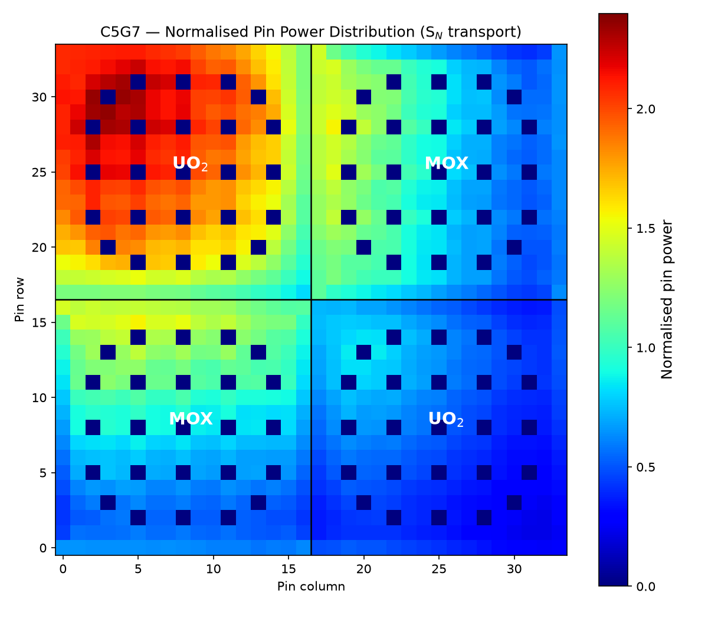
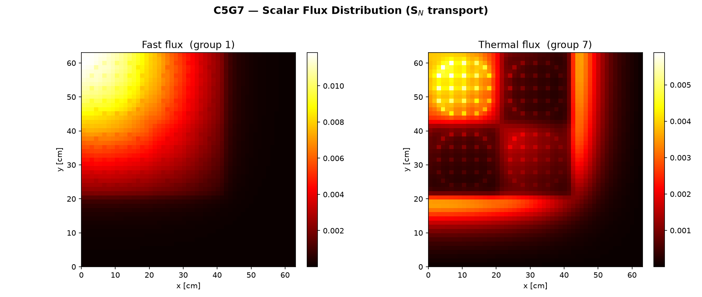
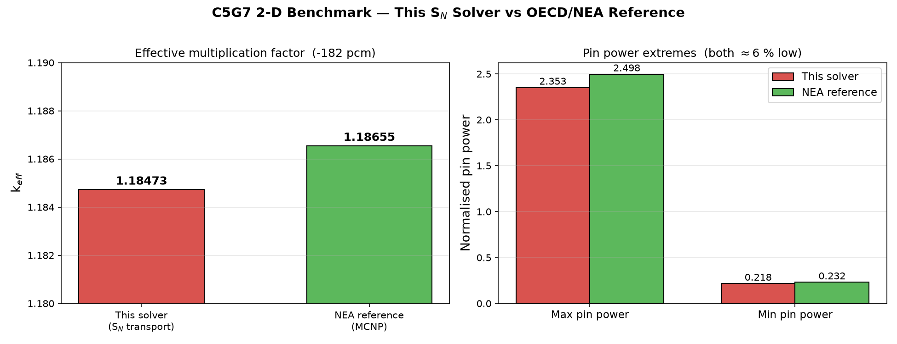

# C5G7 — 2-D 7-Group Neutron **Transport** Benchmark (S<sub>N</sub> Solver)

A from-scratch **discrete-ordinates (S<sub>N</sub>) neutron transport** solver for the
**OECD/NEA C5G7 MOX benchmark**, written in modern Fortran with OpenMP.
Unlike a diffusion solver, this code solves the full angular transport equation
ψ(**r**, **Ω**) over a **heterogeneous pin-by-pin** UO₂ + MOX geometry — **no spatial
homogenisation**, exactly as the benchmark demands.

> This is the transport-theory companion to the
> [IAEA-3D PWR diffusion benchmark](https://github.com/EmreSakarya/iaea-3d-pwr-benchmark).
> Diffusion (Fick's law) is excellent for homogenised, smooth-flux regions; at sharp
> fuel/water interfaces and strong absorbers (MOX, control) it breaks down and one must
> solve the transport equation with explicit angular dependence. C5G7 is the standard
> verification problem for exactly that regime.

---

## Results at a glance

| Metric | This solver (S<sub>N</sub>) | NEA reference (MCNP) | Difference |
|---|---|---|---|
| **k<sub>eff</sub>** | **1.184733** | 1.186550 | **−181.7 pcm** |
| **Max pin power** | 2.353 | 2.498 | −5.8 % |
| **Min pin power** | 0.2182 | 0.232 | −6.0 % |
| MOX assembly symmetry | 21.92 % = 21.92 % | identical | ✓ |

Run: `cells_per_pin = 16` (816×816 mesh), S(24 azimuthal × 4 polar) = 96 directions,
20 OpenMP threads, ~950 s wall time.

All three scalar metrics fall ~6 % below the Monte-Carlo reference in the **same
direction** — the expected, physically-consistent signature of a **stairstep Cartesian**
S<sub>N</sub> discretisation of curved pin boundaries (it slightly smooths the flux peaks
and over-estimates leakage, pulling k<sub>eff</sub> down). Matching the reference to the
last pcm requires the Method of Characteristics (curved-boundary ray tracing); the goal
here is to demonstrate the diffusion → transport step and convergence to the reference.

---

## The benchmark

| | IAEA-3D PWR | **C5G7** |
|---|---|---|
| Physics | 2-group **diffusion** | 7-group **transport** (S<sub>N</sub>) |
| Unknown | φ(**r**) scalar flux | ψ(**r**, **Ω**) angular flux |
| Geometry | homogenised regions | heterogeneous pin-by-pin (UO₂ + MOX) |
| Fuel | single type | UO₂ + 3 MOX enrichments (4.3 / 7.0 / 8.7 %) |
| Source | ANL-7416 | OECD/NEA NEA/NSC/DOC(2003)16 |
| Reference k<sub>eff</sub> | 1.02903 | **1.18655** (MCNP Monte Carlo) |

**Core layout** (2×2 fuel block + L-shaped water reflector, quarter-core symmetry):

```
  reflective (symmetry plane)
        │
   ┌────┴────┬─────────┐
   │  UO₂    │  MOX    │
   ├─────────┼─────────┤   ← vacuum (reflector edge)
   │  MOX    │  UO₂    │
   └─────────┴─────────┘
             │
          vacuum
```

UO₂ on one diagonal, MOX on the other. Each **MOX assembly** internally contains all
three plutonium enrichments as concentric rings: **4.3 %** outer → **7.0 %** middle →
**8.7 %** centre. Each assembly is 17×17 pins, pitch 1.26 cm (21.42 cm/assembly).

---

## Method

- **Angular discretisation:** product quadrature — uniform azimuth × Gauss–Legendre
  polar in ξ = cos θ; weights sum to 4π. Reflective mirror indices built for the
  symmetry planes.
- **Spatial:** fine Cartesian mesh; cylindrical pins represented by a **volume-preserving
  "digital disk"** — within each pin cell the N closest cells to the pin centre are made
  fuel (N = round(πr²/h²)), so the fuel volume is exact at any mesh resolution.
- **Spatial scheme:** diamond-difference sweep with negative-flux fix-up.
- **Boundaries:** West & North = reflective (core symmetry planes); East & South =
  vacuum (outer reflector edge).
- **Eigenvalue:** power iteration; scattering source (incl. thermal up-scatter) relaxed
  by Gauss–Seidel; sweep parallelised over directions with OpenMP.

---

## Build

```bash
# Intel oneAPI (recommended)
ifx -O3 -xHost -qopenmp src/c5g7_transport.f90 -o c5g7

# or GNU
gfortran -O3 -march=native -fopenmp -ffree-line-length-none src/c5g7_transport.f90 -o c5g7
```

Single self-contained file — all cross sections and geometry are inlined, no external data.

## Run

```bash
export OMP_NUM_THREADS=20            # = number of cores
./c5g7 [cells_per_pin] [n_azimuthal] [n_polar] [inner_passes]
```

| Example | Mesh | Directions | Notes |
|---|---|---|---|
| `./c5g7 8  16 3 3` | 408² | 48 | quick check |
| `./c5g7 12 16 3 3` | 612² | 48 | good |
| `./c5g7 16 24 4 3` | 816² | 96 | high res (reported result) |
| `./c5g7 20 32 4 3` | 1020² | 128 | finest |

**Parameters:** `cells_per_pin` (mesh = 51·cpp per side), `n_azimuthal`×`n_polar`
(S<sub>N</sub> order), `inner_passes` (scattering passes per outer, 3 is good).

**Outputs:**
- console — k<sub>eff</sub> convergence history, difference in pcm, assembly power fractions
- `c5g7_flux.csv` — fast (g1) and thermal (g7) scalar flux map
- `c5g7_pinpower.csv` — 34×34 normalised pin power distribution

## Plotting

```bash
python3 scripts/plot_flux.py        # fast + thermal flux maps
python3 scripts/plot_pinpower.py    # normalised pin power heatmap
python3 scripts/plot_benchmark.py   # scalar comparison vs reference
```

---

## Figures

| | |
|---|---|
|  |  |
| **Normalised pin power** — peak in the inner UO₂ corner (near the reflective symmetry plane), suppressed in the outer UO₂ corner (near vacuum). | **Fast (g1) & thermal (g7) flux** — thermal flux bright in UO₂, suppressed in MOX (Pu absorbs thermal neutrons), peaks in guide tubes and reflector. |



The pin-power distribution reproduces the published C5G7 "partially reflected"
assembly maps: the inner UO₂ corner pin peaks (~2.35), the outer UO₂ corner is the
global minimum (~0.22), each MOX assembly shows the 4.3 %→8.7 % ring gradient, and
guide-tube / fission-chamber cells read zero.

---

## Physical verification (flux maps as evidence)

The solution reproduces the known signatures of reactor physics:
- **Thermal flux spikes in guide tubes** (water-filled, no absorption)
- **Thermal flux peak in the reflector** (moderation without fuel absorption)
- **Bright thermal flux in UO₂ / suppressed in MOX** (Pu in MOX absorbs thermal neutrons)
- **Fast flux peaks in the fuel**, decaying toward the reflector

---

## References

1. M.A. Smith, E.E. Lewis, B.C. Na, *Benchmark on Deterministic Transport
   Calculations Without Spatial Homogenisation (C5G7 MOX)*,
   NEA/NSC/DOC(2003)16, OECD/NEA, 2003.
2. M.A. Smith *et al.*, *C5G7 MOX 3-D Extension*, NEA/NSC/DOC(2005)16, OECD/NEA, 2005.

## License

MIT
